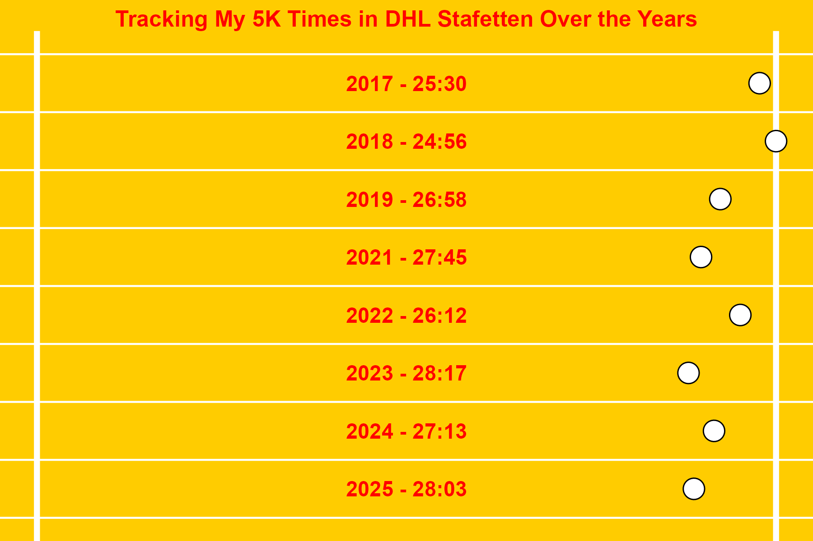

# DHL Stafetten – My 5K Times Visualization

This project visualizes my finishing times from the **DHL Stafetten relay run** (5 km) across several years, using `ggplot2` in R.

## Data
My finishing times from 2017–2025:

| Year | Time   |
|------|--------|
| 2017 | 25:30  |
| 2018 | 24:56  |
| 2019 | 26:58  |
| 2021 | 27:45  |
| 2022 | 26:12  |
| 2023 | 28:17  |
| 2024 | 27:13  |
| 2025 | 28:03  |

## Visualization
- A **100m athletics track style plot** where each lane represents a year.
- Each runner is placed along the track relative to their speed (faster times closer to the finish line).
- Background styled to resemble a track, with lane markers and finish line.

 
